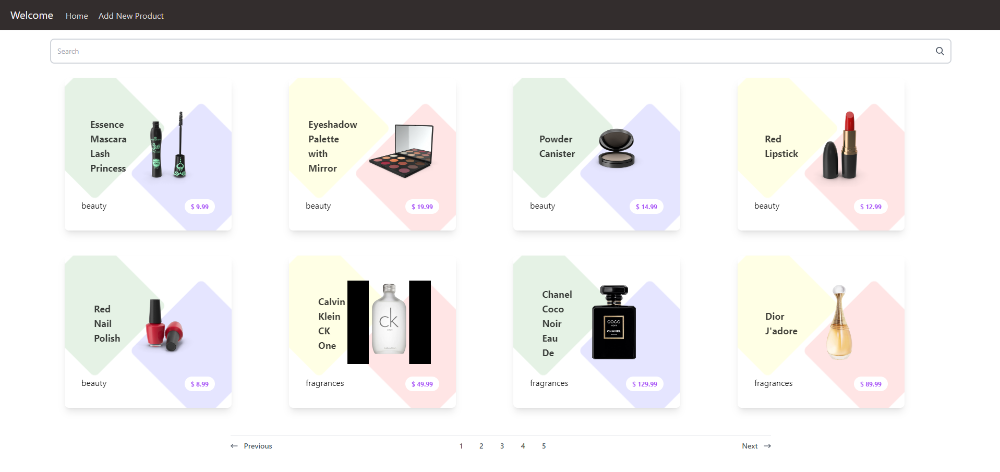
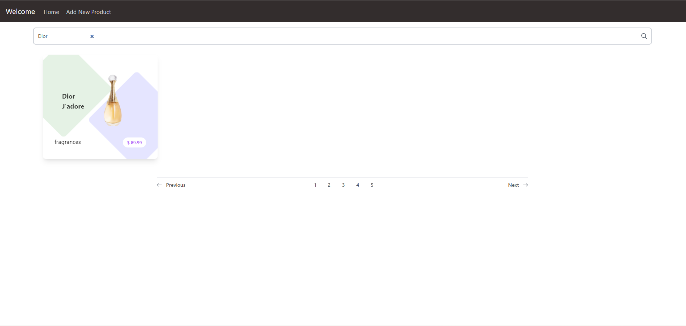
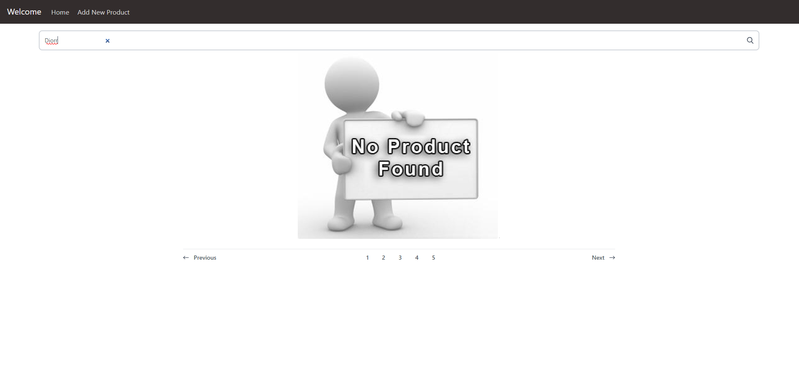
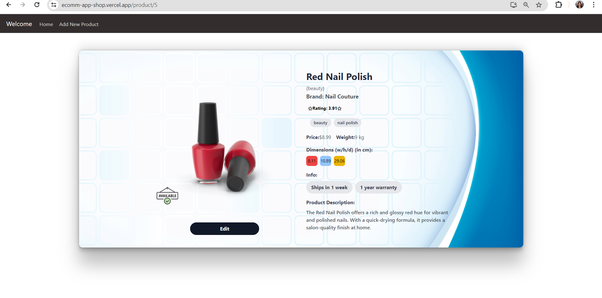
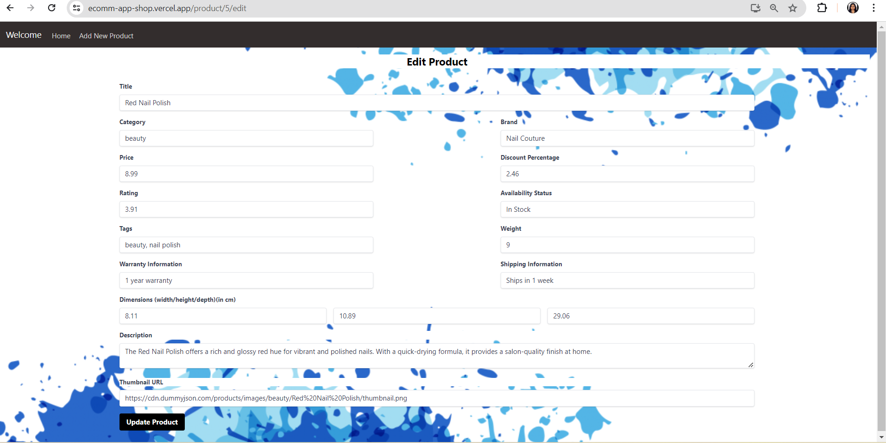

# Product Showcase Web Application

## Introduction
This project is a web application that displays a list of products and allows users to view details of individual products. It is built using React, Redux Toolkit, React Router, and Axios for API calls. The API data is mocked using JSON files. This application aims to provide a simple interface for browsing, viewing, creating, and editing product information.

## Project Type
Frontend

## Deployed App
- Frontend: [https://ecomm-app-shop.vercel.app](https://ecomm-app-shop.vercel.app)

## Directory Structure

    ecomm-agent/
    ├─ public/
    │ ├─ index.html
    ├─ src/
    │ ├─ components/
    │ │ ├─ ProductList.tsx
    │ │ ├─ ProductDetail.tsx
    │ │ ├─ ProductForm.tsx
    │ ├─ redux/
    │ │ ├─ store.ts
    │ │ ├─ slices/
    │ │ │ ├─ productSlice.ts
    │ ├─ App.tsx
    │ ├─ index.tsx
    │ ├─ mock/
    │ │ ├─ products.json
    │ ├─ styles/
    │ │ ├─ tailwind.css
    ├─ package.json
    ├─ tailwind.config.js
    └─ tsconfig.json


## Video Walkthrough of the Project
[Watch the video walkthrough](https://drive.google.com/file/d/1ML8JWY0DolC9mtORiK9F6SsJ7R9i7ZEw/view?usp=sharing)


## Features
- Display a list of products
- View details of individual products
- Create new products
- Edit existing products
- Manage product data with Redux
- Basic routing with React Router
- API calls with Axios
- Basic styling with Tailwind CSS

## Design Decisions or Assumptions
- Used Redux Toolkit for state management for ease of use and simplicity.
- Mocked API data using JSON files to avoid backend dependencies.
- Utilized TypeScript for type safety and better development experience.
- Applied Tailwind CSS for utility-first styling.

## Installation & Getting Started


1. Clone the repository:

   ```bash
   git clone https://github.com/sarikasingh30/ecomm-agent.git
   cd ecomm-agent
   ```

2. Install dependencies:

    ``` bash

    npm install
    ```
3. Start the application:

    ``` bash
    npm start
    ```


## Usage








## Credentials
No authentication is required for this project.

## APIs Used
Data is mocked using local JSON files and deployed later on Render

 API => https://ecomm-backend-api.onrender.com


## API Endpoints
 Here are the API endpoints used in the project along with a brief description of each:

1. **GET /products**
   - Fetch all products from the API.

2. **GET /products/:id**
   - Fetch details of a single product by its ID.

3. **POST /products**
   - Create a new product with the given product data.

4. **PUT /products/:id**
   - Update an existing product by its ID with the given product data.


## Technology Stack

**React**: A JavaScript library for building user interfaces.

**Redux Toolkit**: A toolset for efficient Redux development.

**React Router**: A standard library for routing in React.

**Axios**: A promise-based HTTP client for the browser and Node.js.

**TypeScript**: A superset of JavaScript that adds static types.

**Tailwind CSS**: A utility-first CSS framework for rapid UI development.


---